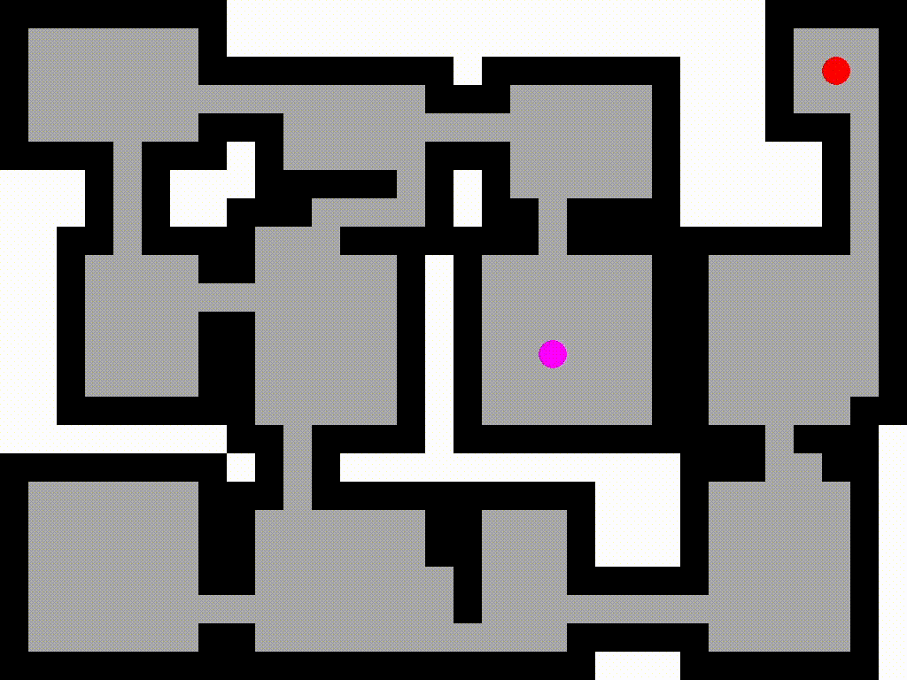
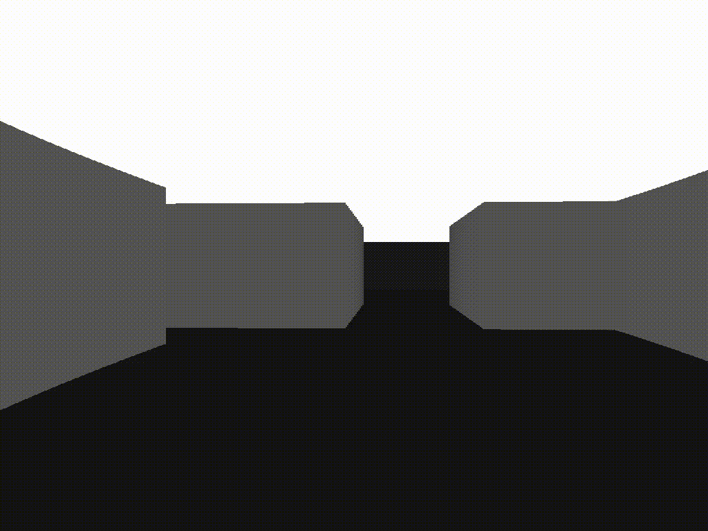

# Map generation and 2D/2.5D projection toggle tech demo

A tech demo that combines map "dungeon" randomized generation (A*) and toggling between 2D top-down and 2.5D DOOM-like raycaster projection.

## Gallery

    
    
Dungeon generation

 

    
    
Toggling perspective between 2D and 2.5D

